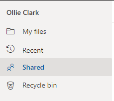
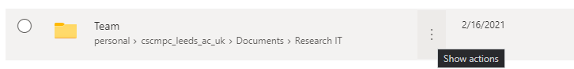
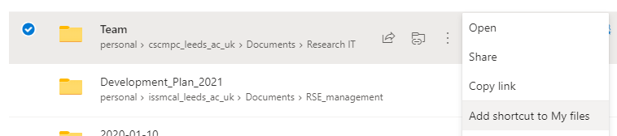

# Using rclone

When transferring large data sets from external sources, it is useful to be
able to connect directly to the external sources (such as OneDrive, DropBox,
Google Cloud, etc) from ARC to transfer the data sets more efficiently. You can
do this using a tool called Rclone which is installed on both ARC3 and ARC4.
You will need to configure a remote shell connection with X11 forwarding (e.g.
on ARC4 using `ssh -Y user@arc4.leeds.ac.uk`) before you can use it.

You can refer to our page on [Graphics Forwarding with (X11)](../logon/x11-graphics) for
details on how to set this up.

## Adding a new OneDrive remote to Rclone

Start Rclone in configuration mode:

```bash
$ rclone config
```

Rclone will display its configuration menu. Choose the New remote option by entering n and pressing Enter:

```bash
$ rclone config
No remotes found - make a new one
n) New remote
s) Set configuration password
q) Quit config
n/s/q> n
```

Next enter the name you want to use for the new remote connection (I use onedrive here but you can choose whatever you want):

```bash
name> onedrive
```

After pressing `Enter`, a list of supported storage types is shown. You should select the Microsoft OneDrive option (the output below is the current version, but will change in the future so please check the number value of OneDrive):

```bash
Type of storage to configure.
Enter a string value. Press Enter for the default ("").
Choose a number from below, or type in your own value
 1 / 1Fichier
   \ "fichier"
 2 / Alias for an existing remote
   \ "alias"
 3 / Amazon Drive
   \ "amazon cloud drive"
 4 / Amazon S3 Compliant Storage Providers including AWS, Alibaba, Ceph, Digital Ocean, Dreamhost, IBM COS, Minio, and Tencent COS
   \ "s3"
 5 / Backblaze B2
   \ "b2"
 6 / Box
   \ "box"
 7 / Cache a remote
   \ "cache"
 8 / Citrix Sharefile
   \ "sharefile"
 9 / Compress a remote
   \ "compress"
10 / Dropbox
   \ "dropbox"
11 / Encrypt/Decrypt a remote
   \ "crypt"
12 / Enterprise File Fabric
   \ "filefabric"
13 / FTP Connection
   \ "ftp"
14 / Google Cloud Storage (this is not Google Drive)
   \ "google cloud storage"
15 / Google Drive
   \ "drive"
16 / Google Photos
   \ "google photos"
17 / Hadoop distributed file system
   \ "hdfs"
18 / Hubic
   \ "hubic"
19 / In memory object storage system.
   \ "memory"
20 / Jottacloud
   \ "jottacloud"
21 / Koofr
   \ "koofr"
22 / Local Disk
   \ "local"
23 / Mail.ru Cloud
   \ "mailru"
24 / Mega
   \ "mega"
25 / Microsoft Azure Blob Storage
   \ "azureblob"
26 / Microsoft OneDrive
   \ "onedrive"
27 / OpenDrive
   \ "opendrive"
28 / OpenStack Swift (Rackspace Cloud Files, Memset Memstore, OVH)
   \ "swift"
29 / Pcloud
   \ "pcloud"
30 / Put.io
   \ "putio"
31 / QingCloud Object Storage
   \ "qingstor"
32 / SSH/SFTP Connection
   \ "sftp"
33 / Sugarsync
   \ "sugarsync"
34 / Tardigrade Decentralized Cloud Storage
   \ "tardigrade"
35 / Transparently chunk/split large files
   \ "chunker"
36 / Union merges the contents of several upstream fs
   \ "union"
37 / Webdav
   \ "webdav"
38 / Yandex Disk
   \ "yandex"
39 / Zoho
   \ "zoho"
40 / http Connection
   \ "http"
41 / premiumize.me
   \ "premiumizeme"
42 / seafile
   \ "seafile"
Storage> 26
```

For the next 3 steps, just accept the defaults by pressing `Enter` twice:

```bash
** See help for onedrive backend at: https://rclone.org/onedrive/ **

OAuth Client Id
Leave blank normally.
Enter a string value. Press Enter for the default ("").
client_id>

OAuth Client Secret
Leave blank normally.
Enter a string value. Press Enter for the default ("").
client_secret>

Choose national cloud region for OneDrive.
Enter a string value. Press Enter for the default ("global").
Choose a number from below, or type in your own value
 1 / Microsoft Cloud Global
   \ "global"
 2 / Microsoft Cloud for US Government
   \ "us"
 3 / Microsoft Cloud Germany
   \ "de"
 4 / Azure and Office 365 operated by 21Vianet in China
   \ "cn"
region>
```

Unless you need to edit the advanced configuration, choose `n`

```bash
Edit advanced config? (y/n)
y) Yes
n) No
y/n> n
```

Choose `y` to auto config:

```bash
Remote config
Use auto config?
 * Say Y if not sure
 * Say N if you are working on a remote or headless machine
y) Yes
n) No
y/n>
```

A new remote Firefox window should appear on your local machine after some time (up to a few minutes), asking you to sign in to your Microsoft account. Use `<username>@leeds.ac.uk` where `<username>` is your university username:


You will then be taken to the University Sign in page:


Once you've authorised access to your OneDrive you can close the browser window and go back to the Rclone configuration interface. Now enter your account type (`1` for the university OneDrive Business accounts):

```
If your browser doesn't open automatically go to the following link: http://127.0.0.1:53682/auth
Log in and authorize rclone for access
Waiting for code...
Got code
Choose a number from below, or type in an existing value
 1 / OneDrive Personal or Business
   \ "onedrive"
 2 / Root Sharepoint site
   \ "sharepoint"
 3 / Type in driveID
   \ "driveid"
 4 / Type in SiteID
   \ "siteid"
 5 / Search a Sharepoint site
   \ "search"
Your choice> 1
```

Then pick the drive to use. You'll probably only be shown one so pick `0`:

```bash
Found 1 drives, please select the one you want to use:
0: OneDrive (business) id=b!MGKmGPBYpUiy2O_SW3nOnWBvZUtBKjpIlZdW32xCnkCTXxII3LCbRYYJ-VSAWKuR
Chose drive to use:> 0
```

Confirm your choice:

```bash
Found drive 'root' of type 'business', URL: https://leeds365-my.sharepoint.com/personal/issokc_leeds_ac_uk/Documents
Is that okay?
y) Yes
n) No
y/n> y
```

Then confirm creation of the remote:

```bash
--------------------
[onedrive]
type = onedrive
token = {"access_token": <token information>}
drive_id = <drive id>
drive_type = business
--------------------
y) Yes this is OK
e) Edit this remote
d) Delete this remote
y/e/d> y
```

Now quit Rclone configuration by pressing `q`

```bash
Current remotes:

Name                 Type
====                 ====
onedrive             onedrive

e) Edit existing remote
n) New remote
d) Delete remote
r) Rename remote
c) Copy remote
s) Set configuration password
q) Quit config
e/n/d/r/c/s/q> q
```

### If remotely opening the browser does not work

Forwarding the Firefox browser in order to authenticate Microsoft OneDrive can be a slow process, but will usually load when given time. If this does not work however, you can follow the remote configuration suggestions given [here](https://rclone.org/remote_setup/). If you have rclone installed on your local pc you can select `n` in response to this prompt and configure it locally as detailed in the [rclone documentation](https://rclone.org/remote_setup/).

```
Remote config
Use auto config?
 * Say Y if not sure
 * Say N if you are working on a remote or headless machine
y) Yes (default)
n) No
y/n> n
```
Alternatively, from Linux, Mac or MobaXterm you can use ssh tunelling to authorise your account by [following the instructions here](http://127.0.0.1:53682/). First, configure your connection and set up a proxy jump on [Linux or Mac](https://arcdocs.leeds.ac.uk/getting_started/logon/logon-off-campus.html#connecting-from-linux-macos-systems) or on Windows through [MobaXterm](https://arcdocs.leeds.ac.uk/getting_started/logon/logon-off-campus.html#using-the-mobaxterm-terminal). Then, connect to ARC4 from your terminal (or from the MobaXterm local terminal) without graphics forwarding, with your arc4 username:

```
ssh <<YOUR USERNAME HERE>>@arc4.leeds.ac.uk
```
and follow the required password and Duo Security prompts. Make note of your login node. Then, launch another local
terminal, and run (with username and login node changed to relevant values):

```
ssh -N -f -L localhost:53682:localhost:53682 <<YOUR USERNAME HERE>>@<<LOGIN NODE HERE>>.arc4.leeds.ac.uk
```
Again, you will be prompted for credentials to log in.
Back in your Arc4 session, run rclone config as normal, and choose `y` when prompted re. automatic configuration. Copy and paste the URL into your local machine's browser. You should be able to access the authentication website from here. If for some reason a remote firefox browser pops up (automatic X-forwarding on MobaXterm, for example), close this. You can continue the rest of the rclone config from the terminal once authentication has been completed.

## Using rclone on HPC

One of our users has written a small utility to make it easier to copy multiple files from OneDrive onto ARC. If you don't fancy the command line options below, you might want to take a look at: [Copy multiple files from OneDrive to ARC](https://foqueiroz.github.io/web/public/arc/index.html)

Once you've set up the remote drive, you don't need to do it again. To list files from OneDrive (list files in [directory] if given):

```bash
$ rclone ls onedrive:[directory]
```

To copy file `<file>` from directory [directory] in OneDrive to your current local directory:

```bash
$ rclone copy onedrive:[path]/<file> .
```

To copy a directory from OneDrive to your current local directory:

```bash
$ rclone copy onedrive:<path> .
```

To copy your entire /nobackup directory to OneDrive:

```bash
$ rclone copy /nobackup/<username> onedrive:ARC4-nobackup
```

To browse the files on your OneDrive using an interactive viewer. Use the arrow keys to navigate (up and down move through the list, right enters a directory, left moves up a directory):

```bash
$ rclone ncdu onedrive:
rclone ncdu v1.47.0 - use the arrow keys to navigate, press ? for help
-- onedrive: ------------------------------------------------------------------------
  3.515G [##########] /ansoft
 29.992M [          ] /ARC4-nobackup
 24.652M [          ]  ubuntu.simg
 12.293M [          ]  SPuRS.mdb
 10.877M [          ] /Apps
  6.977M [          ] /Microsoft Teams Chat Files
  6.925M [          ] /FacultyofEngineering
  4.205M [          ] /srds
  1.074M [          ] /SIS
510.584k [          ] /OfficeDesign
250.469k [          ] /RSECon2019
173.565k [          ] /GDPR
 99.808k [          ] /Admin
 55.359k [          ] /AppDev
 29.371k [          ] /Computing Website
 18.120k [          ] /fengsrv1
 13.299k [          ] /Research Computing
 12.548k [          ]  Document1.docx
 11.941k [          ]  Document.docx
  8.503k [          ] /Azure
       0 [          ] /Attachments
Total usage: 3.611G, Objects: 853
```

Get help on rclone:

```
$ rclone help
```
<!--
Usage:
  rclone [flags]
  rclone [command]

Available Commands:
  about           Get quota information from the remote.
  authorize       Remote authorization.
  cachestats      Print cache stats for a remote
  cat             Concatenates any files and sends them to stdout.
  check           Checks the files in the source and destination match.
  cleanup         Clean up the remote if possible
  config          Enter an interactive configuration session.
  copy            Copy files from source to dest, skipping already copied
  copyto          Copy files from source to dest, skipping already copied
  copyurl         Copy url content to dest.
  cryptcheck      Cryptcheck checks the integrity of a crypted remote.
  cryptdecode     Cryptdecode returns unencrypted file names.
  dbhashsum       Produces a Dropbox hash file for all the objects in the path.
  dedupe          Interactively find duplicate files and delete/rename them.
  delete          Remove the contents of path.
  deletefile      Remove a single file from remote.
  genautocomplete Output completion script for a given shell.
  gendocs         Output markdown docs for rclone to the directory supplied.
  hashsum         Produces an hashsum file for all the objects in the path.
  help            Show help for rclone commands, flags and backends.
  link            Generate public link to file/folder.
  listremotes     List all the remotes in the config file.
  ls              List the objects in the path with size and path.
  lsd             List all directories/containers/buckets in the path.
  lsf             List directories and objects in remote:path formatted for parsi
  lsjson          List directories and objects in the path in JSON format.
  lsl             List the objects in path with modification time, size and path.
  md5sum          Produces an md5sum file for all the objects in the path.
  mkdir           Make the path if it doesn't already exist.
  mount           Mount the remote as file system on a mountpoint.
  move            Move files from source to dest.
  moveto          Move file or directory from source to dest.
  ncdu            Explore a remote with a text based user interface.
  obscure         Obscure password for use in the rclone.conf
  purge           Remove the path and all of its contents.
  rc              Run a command against a running rclone.
  rcat            Copies standard input to file on remote.
  rcd             Run rclone listening to remote control commands only.
  rmdir           Remove the path if empty.
  rmdirs          Remove empty directories under the path.
  serve           Serve a remote over a protocol.
  settier         Changes storage class/tier of objects in remote.
  sha1sum         Produces an sha1sum file for all the objects in the path.
  size            Prints the total size and number of objects in remote:path.
  sync            Make source and dest identical, modifying destination only.
  touch           Create new file or change file modification time.
  tree            List the contents of the remote in a tree like fashion.
  version         Show the version number.

Use "rclone [command] --help" for more information about a command.
Use "rclone help flags" for to see the global flags.
Use "rclone help backends" for a list of supported services.
```
-->

## Using shared folders

If you want to access a folder that has been shared with you on OneDrive you can add the folder to "My Files" in the OneDrive web interface and it will then be available through your rclone connection:

Go to your OneDrive home page and click on Shared



Find the folder you want to access and click on the three dots to the right



Click on "Add shortcut to My files"



The shared folder will now appear in My files and also in your rclone connection.

```
