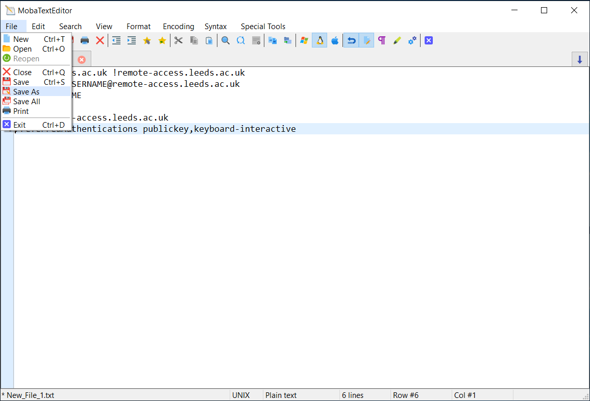
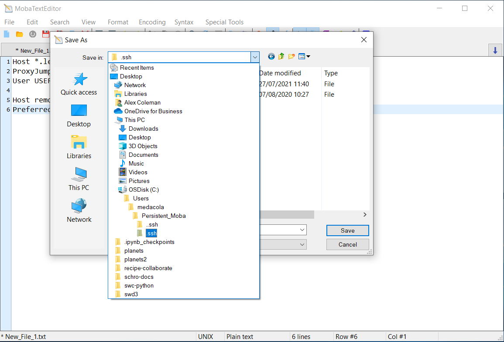
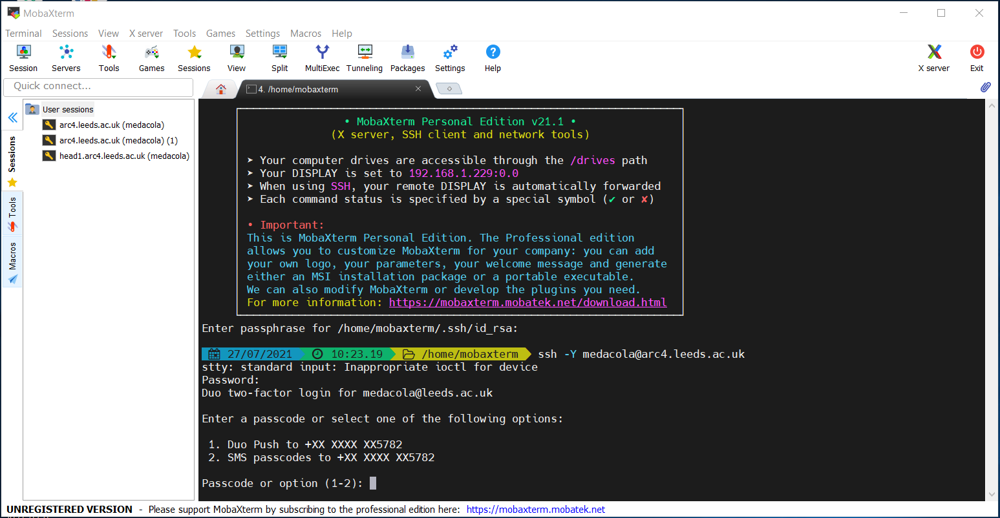

# Logging on

```{warning} **Read carefully**
This is a big article that covers lots of important details about logging in especially for those connecting from off campus.
```

Once you have an account you'll be able to connect to the University HPC systems using a secure shell (SSH). In the page below we'll cover how to make sure you can SSH from your machine (installing any prerequired software) and how to configure your SSH to connect from off-campus.

## Setup

Before you can begin connecting to the University HPC systems you'll need to complete the following setup:

- Have requested and had confirmation that your HPC account has been created. You out more on our [Requesting a HPC Account page](./request_hpc_acct)
- Have an SSH client installed on your device. See below for different details depending on your operating system ([MacOS/Linux](#macos-linux-terminal) or [Windows](#installing-mobaxterm))

### MacOS/Linux Terminal

If you are a MacOS or Linux user you will probably have an SSH client already installed that can be used via the Terminal application on your device.

Open the Terminal application and you're ready to to connect. Next you'll need to read more about [Connecting on campus](#Connecting-on-campus) or [Connecting from off campus](#Connecting-from-off-campus) depending on your circumstances.

### Installing MobaXTerm

To get started you need to install MobaXTerm. You can do this by downloading the **Portable Home edition** [(Click here to go to the download page)](https://mobaxterm.mobatek.net/download-home-edition.html) which is a .zip file containing the software. You can follow the steps in the below video to help walkthrough getting set up.

<iframe src="https://mymedia.leeds.ac.uk/Mediasite/Play/7c25b8af4c7f43f7898efeba0ec6dd311d" width="100%" height="300" frameborder="0" marginwidth="0" marginheight="0" scrolling="auto" allowfullscreen="allowfullscreen" style="display:block;"> </iframe>

## **Connecting from Linux/MacOS systems**

### SSH via Terminal

Linux and MacOS systems all come with a Terminal application that opens a command-line shell. In the following example code snippets we'll be connecting with the username `exuser`. When you come to log in to a system you'll need to use your own university username in place of `exuser`.

To log in from your Terminal use the following command:

```bash
# to log into ARC4
$ ssh exuser@arc4.leeds.ac.uk

# to log into ARC3
$ ssh exuser@arc3.leeds.ac.uk
```

You will then be prompted for your password which you should enter.

```{note} For security placeholder characters
will not appear as you type your password. Your keystrokes are recorded so please type carefully!
```

### Graphics forwarding (X11)

Secure shell allows X display (GUI) traffic to be tunnelled (and encrypted) through the SSH connection. Provided your local display is set up correctly, the -Y flag can be used to allow trusted X11 forwarding:

```bash
$ ssh -Y exuser@arc4.leeds.ac.uk
```

```{note} **For macOS Users**
The latest versions of macOS do not have an X11 client installed so this will need to be downloaded and installed seperately. X11 for Mac can be obtained from the [XQuartz](http://www.xquartz.org/index.html). This is a dmg file so will prompt you with the correct instructions for installation.
```

### Configuring SSH for off-campus connections

```{warning}
**As of July 2021 the University is using 2-factor authentication for password-based access to remote-access.**
You will need to make sure you have [enrolled with Duo with your University account](https://it.leeds.ac.uk/it?id=kb_article&sysparm_article=KB0014659) and will be required to [use Duo to authenticate](https://it.leeds.ac.uk/it?id=kb_article&sysparm_article=KB0014641) after submitting your password to remote-access.
```

In order to connect to ARC when you're off campus you'll need to do some extra configuration so that your SSH connection goes via our `remote-access` server. The following steps outline how to setup this configuration:

1. Open a Terminal on your Linux/macOS machine
2. Create a directory called `.ssh` in your home directory (if one doesn't already exist)

    ```bash
    $ mkdir ~/.ssh
    ```

3. Then open a text editor of your choice and create a file called `config` in your `.ssh` directory

    ```bash
    # for instance use the simple nano text editor
    $ nano ~/.ssh/config
    ```

4. Within this file include the following contents where `USERNAME` is replaced by your university username

    ```
    Host *.leeds.ac.uk !remote-access.leeds.ac.uk
    ProxyJump USERNAME@remote-access.leeds.ac.uk
    User USERNAME
    ```

    ````{admonition} Old version of SSH
    If you're using an old version of OpenSSH, you may get an error: `Bad configuration option: ProxyJump`.  In this case you'll want to use this instead:

    ```
    Host *.leeds.ac.uk !remote-access.leeds.ac.uk
    ProxyCommand ssh -o PreferredAuthentications=keyboard-interactive -W %h:%p USERNAME@remote-access.leeds.ac.uk
    User USERNAME
    ```
    ````

5. Save this file and your configuration is all set up!

You will now be prompted for your password twice everytime you attempt to log into ARC, this is because you are logging into the remote-access server first and then connecting to ARC.

## **Connecting from Windows**

Windows by default does not come with an SSH client. Therefore, we need to install an SSH client and an X server for forwarding graphical applications. We recommend using [MobaXTerm](http://mobaxterm.mobatek.net/) which combines an SSH program (similar to PuTTY), a simple file transfer utility, a text editor and an X-Server into a single package.

### Setting up MobaXTerm

To get started you need to install MobaXTerm. You can do this by downloading the **Portable Home edition** [(Click here to go to the download page)](https://mobaxterm.mobatek.net/download-home-edition.html) which is a .zip file containing the software. You can follow the steps in the below video to help walkthrough getting set up.

<iframe src="https://mymedia.leeds.ac.uk/Mediasite/Play/7c25b8af4c7f43f7898efeba0ec6dd311d" width="100%" height="300" frameborder="0" marginwidth="0" marginheight="0" scrolling="auto" allowfullscreen="allowfullscreen" style="display:block;"> </iframe>

### Connecting via MobaXTerm

```{warning}
**As of July 2021 the University is using 2-factor authentication for password-based access to remote-access.**
You will need to make sure you have [enrolled with Duo with your University account](https://it.leeds.ac.uk/it?id=kb_article&sysparm_article=KB0014659) and will be required to [use Duo to authenticate](https://it.leeds.ac.uk/it?id=kb_article&sysparm_article=KB0014641) after submitting your password to remote-access.
```

Once you have MobaXTerm downloaded you can connect to ARC via two mechanisms: using the builtin local terminal to connect using SSH commands; or creating an SSH session via the GUI.

#### Creating an SSH session

You can create an SSH session to connect to ARC using the following steps:

| 1. Open the initial MobaXTerm Menu and select Session |
| ----------------------------------------------------- |
|  |

| 2. In the Session Wizard Window select SSH |
| ----------------------------------------------------- |
|  |

| 3. Input the basic setting details for SSH session: the host (address of ARC), the username (your university username) |
| ----------------------------------------------------- |
|  |

| 4. Select the Network Settings tab within the Session Settings window |
| ----------------------------------------------------- |
|  |

| 5. Click on the large button labelled "SSH gateway (jump host)" and input details for connecting to remote-access.leeds.ac.uk (Gateway SSH server) and specify your username |
| ----------------------------------------------------- |
|  |

| 6. You will immediately be prompted for your password to connect to the remote-access server |
| ----------------------------------------------------- |
|  |

| 7. You will immediately be prompted for to enter your [Duo two-factor code](https://it.leeds.ac.uk/it?id=kb_article&sysparm_article=KB0014641) which can be found on your Duo App |
| ----------------------------------------------------- |
|  |

| 8. After it accepts your password it will request your password again, this time to log into ARC4 (This may not happen automatically and you may need to double click on session name that appears on the right hand User sessions section) |
| ----------------------------------------------------- |
|  |

```{note} For security placeholder characters
will not appear as you type your password. Your keystrokes are recorded so please type carefully!
```

| 9. Once successful you will see the ARC4 message of the day and the ARC prompt |
| ----------------------------------------------------- |
|  |

| 10. You can restart an existing session after it has closed by double-clicking the session under the User sessions folder on the left-hand panel of the main MobaXTerm menu |
| ----------------------------------------------------- |
|  |

#### Using the MobaXTerm Terminal

Alternatively, you can connect to ARC using the builtin Terminal within MobaXTerm and use the `ssh` command. 

##### Configuring MobaXTerm Terminal

In order to successfully connect off-campus you are required to adjust some settings within MobaXTerm to create a persistent home directory and create a configuration file for SSH.

| 1. Open the initial MobaXTerm Menu and select Settings |
| ----------------------------------------------------- |
|  |

| 2. Select the folder icon on the right-hand side of the Persistent home directory setting box |
| ----------------------------------------------------- |
|  |

| 3. Select a folder location to use for your persistent home directory (this can be any writeable folder on your computer), here I am using my C:\User\university_username folder |
| ----------------------------------------------------- |
|  |

| 4. This takes you back to the MobaXTerm Setting Menu, where you can now select OK  |
| ----------------------------------------------------- |
|  |

| 5. You will then be prompted to restart MobaXTerm so that the new settings are applied |
| ----------------------------------------------------- |
|  |

| 6. When MobaXTerm restarts, select the Start Local Terminal option |
| ----------------------------------------------------- |
|  |

| 7. This takes you to the MobaXTerm terminal view |
| ----------------------------------------------------- |
|  |

| 8. Next create a folder called `.ssh` using the command `mkdir .ssh` |
| ----------------------------------------------------- |
|  |

```{note} If this folder already exists you will get an error saying this file/folder already exists just skip to step 9
```

| 9. Then go to Tools > MobaTextEditor   |
| ----------------------------------------------------- |
|  |

| 10. Type the contents of the file as follows where `USERNAME` is your university username |
| ----------------------------------------------------- |
| <pre id="codecell0"> Host *.leeds.ac.uk !remote-access.leeds.ac.uk <br> ProxyJump USERNAME@remote-access.leeds.ac.uk <br> User USERNAME <br> <br> Host remote-access.leeds.ac.uk <br> PreferredAuthentications publickey,keyboard-interactive </pre> |
|  |

| 11. Once complete go to File > Save As  |
| ----------------------------------------------------- |
|  |

| 12. Select the `.ssh` folder you created in the step 8.  |
| ----------------------------------------------------- |
|  |

| 13. Name the file as `config` and press Save and close MobaTextEditor |
| ----------------------------------------------------- |
|  |

And now MobaXTerm should be configured so we can SSH to ARC using the MobaXTerm Terminal.

##### SSHing via the MobaXTerm Terminal

We can use the MobaXTerm Terminal like a standard unix shell to navigate around our local computer and also to SSH onto remote hosts including ARC. In order to connect to ARC we need to make sure we have configured MobaXTerm as described in [the above section](#configuring-mobaxterm-terminal)

| 1. Within a local Terminal on MobaXTerm we use the `ssh` command to connect to ARC |
| ----------------------------------------------------- |
|  |

| 2. We are then prompted to submit our password to connect to `remote-access.leeds.ac.uk` |
| ----------------------------------------------------- |
|  |

| 3. We are then prompted select how to receive a Duo 2 factor authentication prompt either via the app or as a text message. Select your preferred option and either approve the push or input a passcode that is sent to you via SMS |
| ----------------------------------------------------- |
|  |

| 3. We are then prompted to submit our password to connect to `arc4.leeds.ac.uk` |
| ----------------------------------------------------- |
|  |

| 4. Once we have successfully submitted our passwords our prompt will change and the message of the day for ARC4 will be displayed |
| ----------------------------------------------------- |
|  |
