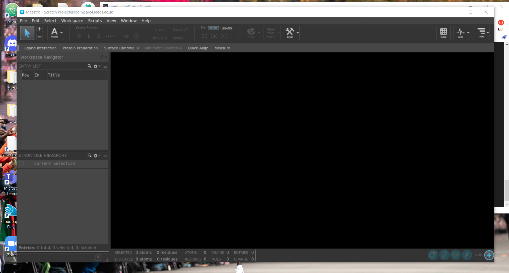

# Schrodinger

Both ARC3 and ARC4 have Schrodinger Suite 2020-1, Build 12 installed.

## Description

The [Schrodinger suite](https://www.schrodinger.com/platform), developed by [Schrodinger Inc](https://www.schrodinger.com/), is computational chemistry programme with a number of different tools for evaluating compounds in silico, with experimental accuracy on properties such as binding affinity and solubility.

## Licensing

To run Schrodinger suite programs a license is required and limits the number of cores available. You will be unable to load any schrodinger suite tools until you have specified the relevant license server information which you should request from your supervisor or department.

You will then need to set an environment variable when logged into ARC3/ARC4 that specifies the license host address and port number as follows:

```bash
# this is an example
$ export SCHROD_LICENSE_FILE=<port>@<host>
```

You will also need to include this within any job submission scripts to ensure your jobs don't terminate early because they haven't got the license server configured.

## Documentation

Documentation is available for Schrodinger on ARC3/ARC4. It is possible to load this directly on ARC3/ARC4 when connecting with [X11 graphical forwarding](../../getting_started/logon#graphics-forwarding-x11), using FireFox to open the HTML documentation pages with the following command:

```bash
$ module add schrodinger/2020-1

$ firefox $SCHRODINGER_HOME/docs/Documentation.htm
```

## Basic Usage

To access some of the Schrodinger suite of tools you can load the module with the command:

```bash
$ module add schrodinger/2020-1
```

This allows you to access a number of executeables from the command line and adds a new environment variable `$SCHRODINGER_HOME` from which it is possible to access more executeables via the `$SCHRODINGER_HOME/utilities` directory.

### Maestro

```{warning}
To use maestro from ARC3/ARC4 you will need to connect with [X11 graphical forwarding](../../getting_started/logon#graphics-forwarding-x11) enabled
```

Maestro is the primary graphic user interface to the Schrodinger suite of tools and can be used to submit jobs directly to the scheduling system.

To start maestro you will need to have added the schrodinger module and set the license server environment variable, after which you can run:

```bash
$ maestro 
```

This will load up a separate window containing the maestro GUI.



```{note}
It is not recommended to use maestro for developing your workflows via this method as the user experience can be quite laggy. It is **recommended** workflow files are produced on your local machine using Schrodinger 2020-1 and uploaded to ARC4 for use on the batch queuing system.
```

